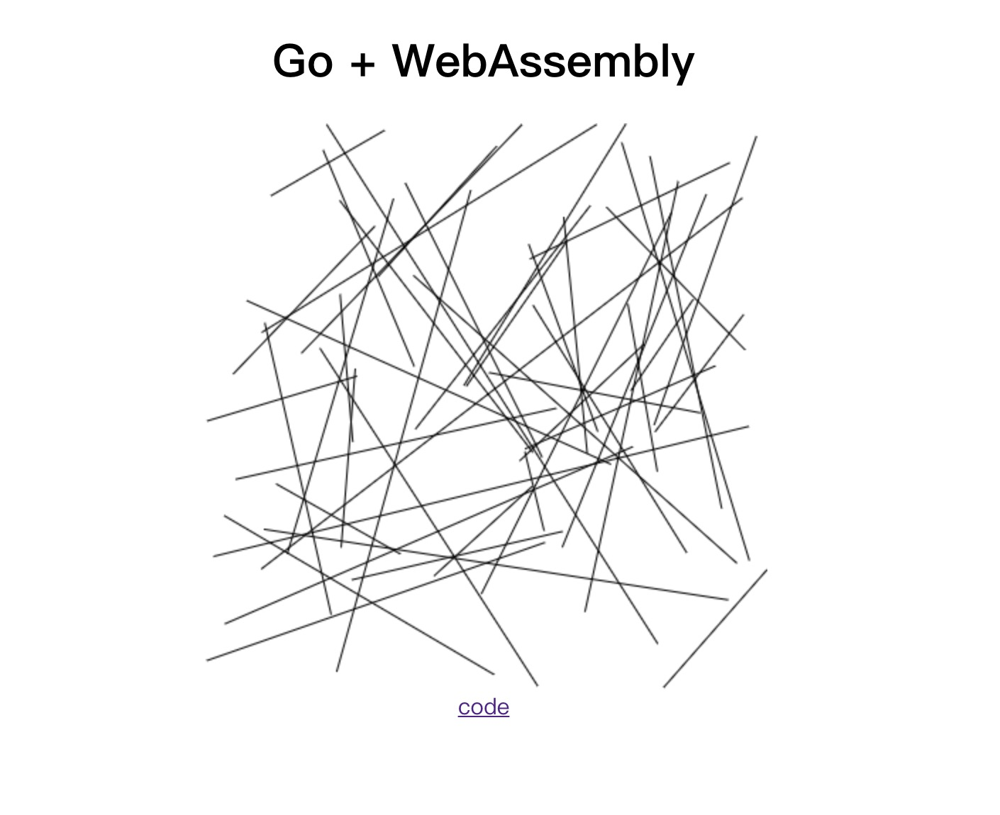

# go-webassembly-canvas

Writing a very simple canvas toy with WebAssembly and Go

### Development

1. build wasm
    ``` bash
    GOARCH=wasm GOOS=js go build -o ./wasm/lib.wasm main.go
    ```

2. start http server
    ``` bash
    go run server.go 
    ```
3. visit http://localhost:4200
  